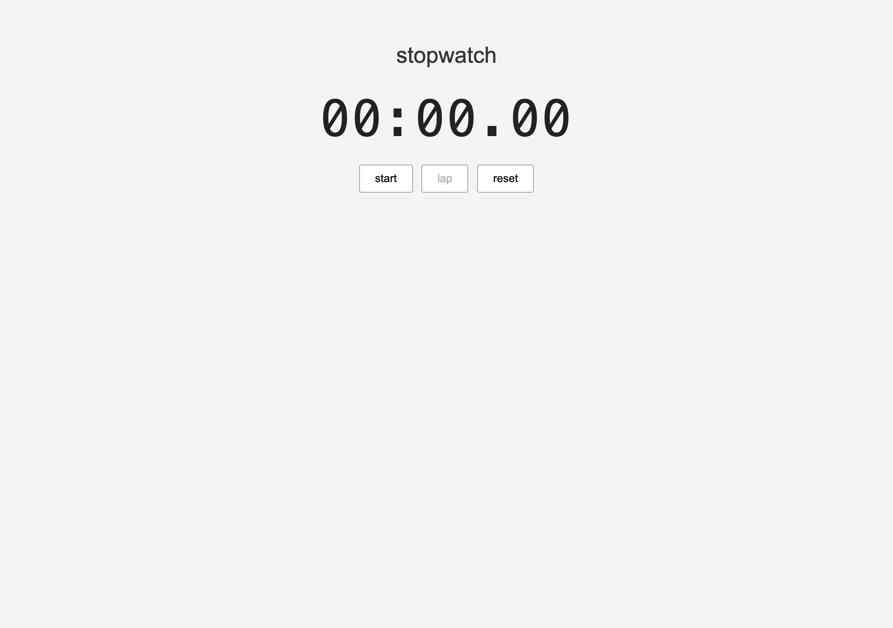
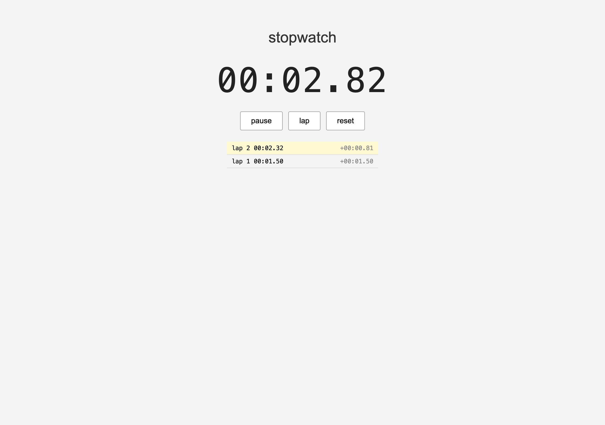

# stopwatch

  
  

little stopwatch i made to practice setInterval and Date.now. has a lap button.

## how to run

just open index.html in a browser. no build step, no install.

## what it does

- big mm:ss.cc display
- start / pause / reset
- lap button that logs lap times and shows the delta from the previous lap

## notes

i tried using setInterval at first but the time was drifting because the callback isn't perfectly on schedule. so the time is calculated from Date.now() differences instead and setInterval is only used to refresh the display. that fixed it.

lap delta = current total - previous lap total.

released under PolyForm Noncommercial 1.0.0, see LICENSE.
